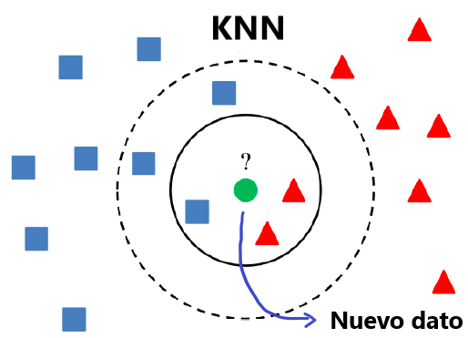
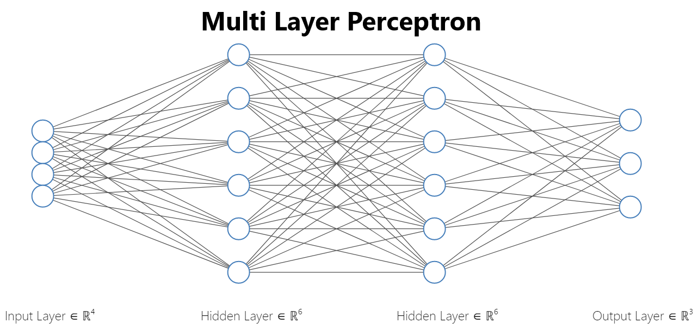

# Iris predictive model

Para predecir a que clase pertenece la flor probamos dos modelos diferentes. En el primero utilizamos
_**K-Nearest Neighbors**_ y en el segundo un _**Multi Layer Perceptron**_. El análisis completo con el
código se puede encontrar en el archivo [Iris.ipynb](Iris.ipynb)

### Requerimientos

Se utilizó **python 3.7.10** y las librerías con sus respectivas versiones que se pueden
encontrar en [requirements.txt](requirements.txt). Para correr directo en Google Colab, se puede
utilizar este [link](https://colab.research.google.com/drive/1Hx6YIsCGQcWWJZtc1K6Gfn8VtyjeIa3N?usp=sharing).

## Modelo **#1**

La idea de este método ([KNN](https://en.wikipedia.org/wiki/K-nearest_neighbors_algorithm)) es clasificar un nuevo dato de entrada en base a una 'votación'.
Con alguna **función de distancia** (i.e: euclidean distance) se calcula la cercanía del nuevo punto
con el resto de los puntos. A partir de este resultado se selecciona los **top k** más cercanos. Finalmente,
se elige la clase con **mayor frecuencia**.

Por ejemplo, en el diagrama de arriba, el nuevo dato
de entrada correspondería a la clase roja si `k=3`.
**KNN** es un algoritmo simple ya que solo se requiere de un solo hiperparámetro **k**.

_Nota: También se puede cambiar la función de distancia, en este caso se utilizó la distancia euclidiana_

### Resultados con distintos K

| K  | Test Accuracy |
| ------------- | ------------- |
| 3  | 0.9333 % |
| 5  | **0.9778** % |
| 7  | 0.9778 % |
| 9  | 0.9778 % |
| 11  | 0.9333 % |

## Modelo **#2**

El **Multi Layer Perceptron** (MLP) propuesto es un **modelo simple** que consta de dos **hidden-layers**, cada uno de 6
neuronas. Como **no linealidad**/**función de activación** para estas capas mencionadas utilizamos [ReLU](https://pytorch.org/docs/stable/generated/torch.nn.ReLU.html).

La cantidad de neuronas de entrada corresponde a la cantidad de **features**/**x** utilizadas
del **dataset iris**. Por último, las 3 **neuronas de salidas** corresponden a la cantidad de tipos
de flores. La función de coste de **PyTorch** [CrossEntropyLoss](https://pytorch.org/docs/stable/generated/torch.nn.CrossEntropyLoss.html)
ya incluye LogSoftmax por lo que no se utiliza **ReLU** para el último layer.

## Resultados finales

### Accuracy de los modelos
| Modelo  | Test Accuracy |
| ------------- | ------------- |
| KNN k=5  | 0.9778 % |
| MLP  | **100.00 %** |
